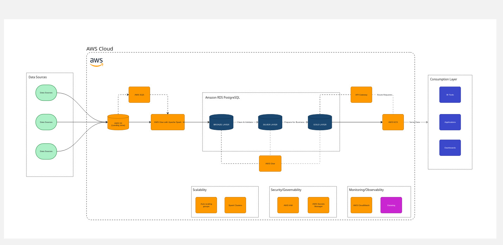

# Spexs.ai Data engineering challenge

## 1. Definicion de la arquitectura
Para la arquitectura, definiremos 2 diagramas: el primero seria el diseño optimo para implementar en un entorno productivo considerando los detalles propuestos en el challenge. Mientras que el segundo diagrama ilustra la solucion desarrollada a modo de ejemplo para simular el comportamiento de la plataforma de datos pero en un entorno local. Esta decision se debe principalmente al limitante de tiempo para desarrollar una solucion completa en un entorno cloud, como tambien los costos de desarrollo que implicaria desplegar los servicios. 
En la siguiente documentacion se haran las aclaraciones y diferenciaciones pertinentes para diferenciar el desarrollo local del potencial productivo representado en el primer diagrama.

### 1.1 Arquitectura Ideal - Cloud based
Debido a que el ejercicio propuesto en el challenge posee limitada descripcion del caso de uso, las siguientes suposiciones fueron tomadas en cuenta para el desarrollo:

- Las fuentes de datos no estan definidas (tipo, plataforma, cadencia, etc.), por lo que se asume que las fuentes de datos van a ingestar los archivos directamente en un bucket de S3.
- El lenguaje de programacion sera Python.
- El end-point de la plataforma sera una API expuesta para ser consumida por los distintos casos de uso (engineers, front-end, reporting tools, etc.)

### 1.2 Arquitectura implementada - local based

### 1.3 Modelo de datos
Para el modelo de datos, se abordo una arquitectura del tipo Medallion, compuesta de 3 capas: Bronze, Silver y Gold. Con el siguiente proposito:
- Bronze layer: Datos crudos, con transformaciones minimas como eliminacion de filas nulas, agregado de campos de metadata como INSERTED_ON or EXTRACTED_ON necesarios para la correcta auditoria del sistema
- Silver layer: Datos curados, con limpieza mas profunda de los tipos de datos, nombres de atributos, transformaciones sin agregaciones o transformaciones de alto impacto, agregacion de multiples fuentes de datos en un solo objeto.
- Gold layer: Datos listos para el consumo, agregaciones alineadas a las reglas de negocios, metricas y KPIs, calculos complejos.

.jpg)
